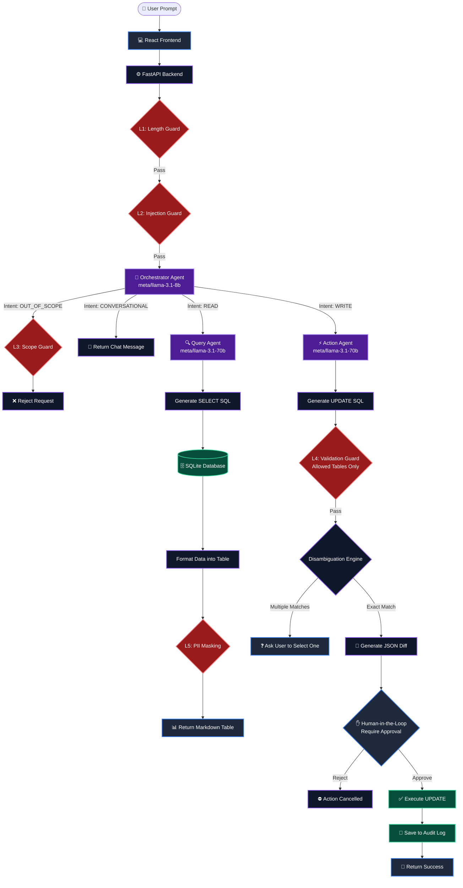

  <h1>🎯 HobbyFi Copilot</h1>
  
<strong>An AI-powered natural language interface for sports facility vendors</strong>

HobbyFi Copilot transforms how sports facility vendors interact with their CRM data. Instead of navigating complex dashboards to find expiring trials, check revenue, or cancel memberships, vendors can simply type what they want in plain English. The Copilot translates these intents into safe, validated SQL operations and executes them.

---

## ✨ Features

- **Natural Language Queries**: Ask questions like *"What is my total membership revenue so far?"* or *"Show me all active trials for my academy."*
- **Safe Database Mutations**: Instruct the AI to update records, e.g., *"Cancel Rahul Verma and Priya Sharma's badminton trials."*
- **Disambiguation Engine**: If a vendor asks to cancel *"Rohan's trial"*, but multiple Rohans exist, the backend detects the ambiguity and pauses to ask the user which one they meant.
- **Human-in-the-Loop (HITL)**: All database mutations calculate a JSON diff and pause for explicit vendor approval via a visual frosted-glass UI card.
- **Premium Aesthetics**: Built with a sleek, dark-mode glassmorphism design language using TailwindCSS.

## 🛡️ 5-Layer Security & Guardrails

AI interfaces dealing with real databases must be incredibly secure. We built a robust 5-layer defense mechanism:

1. **Length Constraints**: Hard limits on input length to prevent buffer bloat and excessive token consumption.
2. **Prompt Injection Prevention**: Blocks malicious keywords (`drop table`, `ignore previous instructions`, etc.).
3. **Domain Scope Enforcement**: Rejects queries unrelated to CRM data (e.g., *"write a poem"*).
4. **SQL Validation**:
   - `READ` operations are strictly limited to `SELECT` queries.
   - `WRITE` operations must be `UPDATE` queries, must enforce `vendor_id` scoping, and are strictly restricted to `trials`, `bookings`, and `memberships` tables (protecting the `users` and `revenue` tables from being modified).
5. **PII Masking**: Automatically detects and redacts sensitive information (emails, phone numbers) before data is presented to the user.

## 🧠 Multi-Agent Architecture

To balance speed and intelligence, we implemented a dual-model orchestration layer using `ChatNVIDIA` LangChain integrations:

- **The Orchestrator (meta/llama-3.1-8b-instruct)**: A blazing-fast router that classifies user input into `READ`, `WRITE`, `CONVERSATIONAL`, or `OUT_OF_SCOPE`. By offloading routing to an 8B model, we achieved near-instant responsiveness for initial intent classification.
- **The Specialists (meta/llama-3.1-70b-instruct)**: For complex reasoning, schema navigation, and SQL generation, we utilized the powerful 70B model. This ensures that the generated SQL perfectly maps to the database structure, properly utilizes `IN` clauses for multi-user actions, and respects the vendor's scope.

### Architecture Flowchart

## 🛠️ Running Locally

### Backend Setup
1. Navigate to the `backend` directory.
2. Create a virtual environment: `python -m venv venv`
3. Activate the virtual environment:
   - Windows: `venv\Scripts\activate`
   - Mac/Linux: `source venv/bin/activate`
4. Install dependencies: `pip install -r requirements.txt` (or install FastAPI, Uvicorn, SQLAlchemy, LangChain, etc.)
5. Create a `.env` file and add your NVIDIA API key: `NVIDIA_API_KEY=your_key_here`
6. Run the database seed script to populate dummy data: `python seed_data.py`
7. Start the API server: `python -m uvicorn main:app --reload`

### Frontend Setup
1. Navigate to the `frontend` directory.
2. Install dependencies: `npm install`
3. Start the Vite development server: `npm run dev`

Navigate to `http://localhost:5173` to interact with the HobbyFi Copilot!
