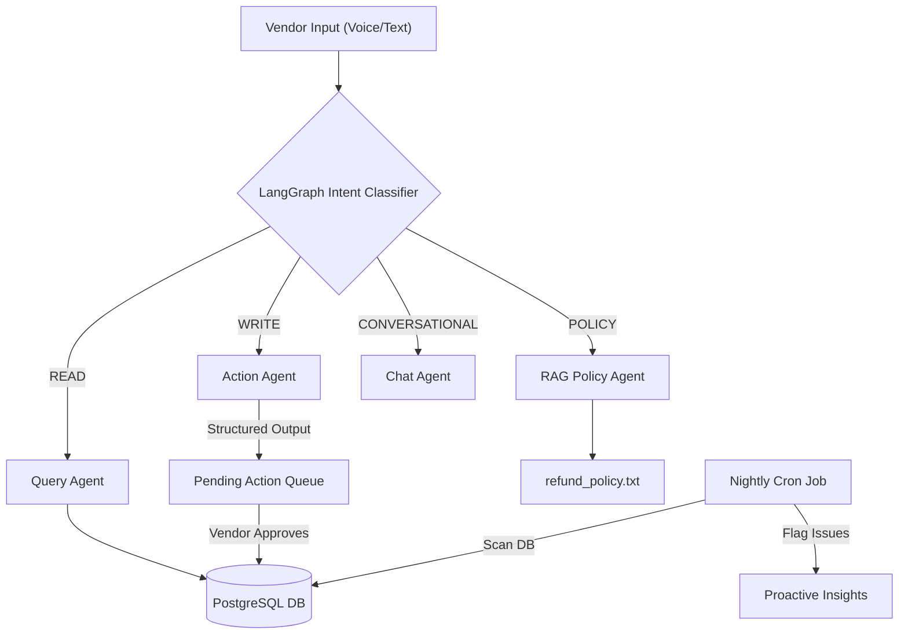

# 🚀 Sports Facility AI Copilot

An enterprise-grade, agentic AI copilot designed for sports facility vendors. It replaces traditional clunky dashboards with a natural language interface that supports voice commands, complex bulk operations, generative charts, and proactive insights.

---

## 🏗️ Architecture V2

The V2 architecture represents a massive shift from a basic LLM wrapper to an asynchronous, stateful, and highly scalable multi-agent system.

### 🔹 Core Upgrades
- **Asynchronous PostgreSQL (asyncpg)**: The entire database and routing layer runs asynchronously, allowing the FastAPI backend to handle high-concurrency vendor environments without blocking.
- **LangGraph State Routing**: Replaced rigid regex-based routing with a formal `StateGraph` that accurately maps user intent (Read, Write, Policy, Conversational) to specialized agents.
- **Structured Outputs (Pydantic)**: The Action Agent now leverages strict JSON Schema enforcement via Native Tool Calling. This guarantees that database mutations (like canceling memberships) are 100% syntactically correct and safe before execution.
- **Voice-to-Text (NVIDIA NIM Whisper)**: Integrated `MediaRecorder` in the React frontend to stream `.webm` audio to a FastAPI `/transcribe` endpoint powered by NVIDIA's `openai/whisper-large-v3` microservice.
- **Retrieval-Augmented Generation (RAG)**: A dedicated Policy Agent reads facility rules (cancellation, refunds) and provides grounded answers, mitigating LLM hallucinations.
- **Proactive Marketing Cron**: An `APScheduler` background task runs nightly to scan the database for anomalies (e.g., expiring trials, revenue drops) and flags them proactively to the vendor.

---

## 🔄 Agentic Flowchart

## 🛠️ Tech Stack

### Frontend
- **React (Vite)**
- **TailwindCSS** for styling
- **Recharts** for Generative UI 
- **Lucide-React** for iconography
- Native browser `MediaRecorder` API

### Backend
- **Python 3.11+**
- **FastAPI** (with standard Server-Sent Events for streaming)
- **SQLAlchemy (Async)** with `asyncpg`
- **LangChain & LangGraph** for agent orchestration
- **NVIDIA NIM** (Llama 3.1 70B & Whisper Large V3)
- **APScheduler** for background jobs

---

## 🚀 Deployment Instructions

### 1. Database (Render)
Provision a PostgreSQL database on Render. Update your environment variables to use the `postgresql+asyncpg://` prefix.

### 2. Backend (Render Web Service)
Connect your GitHub repository to a Render Web Service.
**Environment Variables Required:**
- `DATABASE_URL`: Your PostgreSQL connection string.
- `NVIDIA_API_KEY`: Your NIM access key.
- `FRONTEND_URL`: Your Vercel domain (for CORS).

### 3. Frontend (Vercel)
Import the repository into Vercel and set the Framework Preset to **Vite**.
**Environment Variables Required:**
- `VITE_API_URL`: Your deployed Render backend URL.
